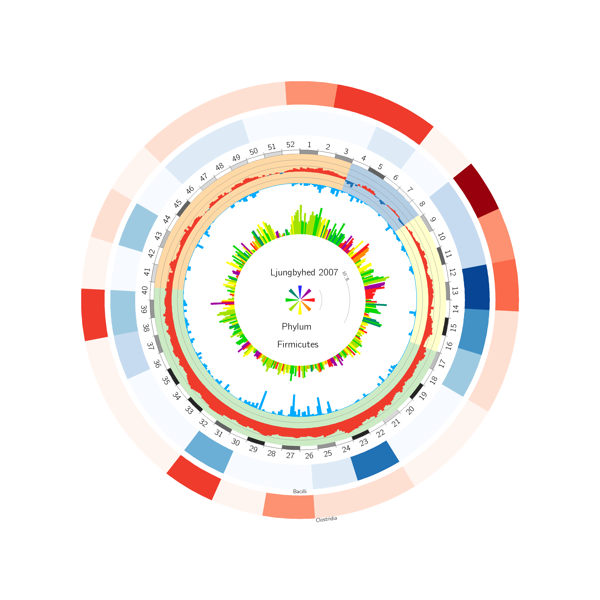
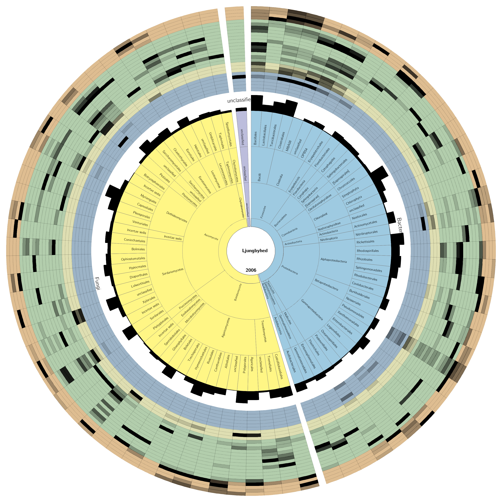

Circos Meta Plots
=================
A python package for plotting metabarcoding data for every other week in a year together with weather data in Circos.  

Year Plot
---------

The year plot is based around the visualization of the year as a circle. Each week has a corresponding ideogram, which is coloured after the total amount of reads for that air filter, making it a heat map. 
The ideograms of the weeks that were not sequenced are left as white. 

Outside the year circle the amplicon reads are plotted in heat maps. While only reads for every other week were presented, the field representing those weeks were 
widened to go halfway across the neighbouring weeks as well. This was done to avoid the gaps that would make it hard to follow the heat map around the year. 
Otherwise the regularly spaced gaps would lure the viewers eye to follow the lines created by the gaps rather than heat map rings. 

The width of the heat map rings represents the difference in amounts between the taxa. The width is determined by the logarithm of base ten of the maximum number of 
amplicon reads in one air filter across all air filters. The name of the plotted taxon was written directly under the heat map. Because Circos is unable to stack text without 
shifting outer labels out of position, the heat map legends are spread out around the bottom half of the image, starting from the middle and going outwards, alternating left and right. 

The inside of the year circle is used to plot the following weather data: temperature, precipitation,  mean wind strength and wind direction.

The temperature is visualized in a track bordering the year, which is coloured according to the season. The season colours were used primarily as an overview, with 
the temperature for each day plotted in a histogram inside the coloured track. To make the plot easier to read at temperatures around 0°C, temperatures equal to or above 
zero are shown in red, and those below in blue. Furthermore, there are axis lines for every tenth degree. In the histogram the maximum and minimum temperatures are set to 30°C and 
-20°C, respectively, and temperatures beyond that are cut off. This was done to compare directly plots from locations with different temperatures over the year. In Sweden, temperatures rarely 
reach extremes. Thus, the difference in impact between temperatures at exactly -20°C and below -20°C is negligible, and the same is true for temperatures at and over thirty degrees.  

The precipitation over the year is plotted as a bar plot, starting from the inner edge of the season track. 

The last bar plot depicted the mean wind speed for each day and it was placed closest to the middle, with the histogram bars directed outward. Each bar was coloured according to the direction the 
wind was blowing that day and calculated as the mean from 24 values per day. A compass rose was located in the middle of the plot, with the eight cardinal and intercardinal directions, showing 
which direction each colour represents.

The year plot tool can be run for a single taxon or for all OTUs.  In the first case, the taxa ranked below the given one will be plotted: if the kingdom Fungi is given, then the phyla from that kingdom is plotted. 
In the second case, the parameter is the lowest taxonomic rank to be plotted. Starting from kingdom, the lower taxonomic ranks are recursively plotted until the stop rank is reached. Each taxon gets its own folder, 
with the plot depicting the direct descendants in the clade, and the successive folders for each of the taxa. 

Taxonomy Plot
-------------
The taxonomy plot is at its base a hierarchal donut chart, which is surrounded by rings of heat maps. The OTUs from air filters from one station and one year are visualized in the plot.

The hierarchal donut chart displays the taxonomy of the OTUs. The OTUs are divided and coloured after the highest taxonomic rank, which is usually kingdom. 
The taxonomic ranks are displayed with the highest rank closest to the center of the donut, followed by successive lower ranks going out from the center of the donut.
The start and end ranks were given as parameters when calling the visualization tool. 
The heat maps correspond to the taxa on the outmost level of the donut chart. The reads belonging to that taxa were summed and displayed per air filter. The first ring of heat maps was the air 
filter from the first week of the year, with the rest following chronologically, with the air filter from the last week of the year furthest out. Since samples from every other week was sequenced, 
the total number of weeks over the year was 26. Each week is coloured according to the season.    

In the heat maps the amplicon reads were normalized to lie between 0 and 1. Since the rings were plotted one at a time, and without normalization the only thing shown in the heat maps would be which taxon 
had the highest number of reads for each week. Thus, the pattern over the year for each taxon was shown in the plot rather than a comparison of the amounts between taxa. Because the number of reads may vary widely 
between taxa, a histogram was included at the outer edge of the hierarchal donut chart to show the logarithm of ten of the maximum number of reads in one air filter for each taxa.

The heat maps showing the total number of reads are transparent to black, with black corresponding to the maximum number of reads in one week. The colour below the heatmap represented the season it 
was during that week. 

Dependencies
------------
Python >=3.3. pandas, numpy, subprocess and shutil.

For Circos dependencies, see http://circos.ca/

How to use
----------

The capitalization does not matter for the names and ranks of taxa. For the taxonomic ranks the user can either write the whole name, or only the first letter. If written out, the taxonomic rank must be written in singular form.
While the order the arguments come in is important, it does not matter if there are lines of white space in between them or in the beginning of the file. The lines of the input file with more than one parameter should separate them with one or more space or tab characters.

Season colors will fail if summer never ends, but the don't need to be plotted.

import circosmetaplots as cmp
yplot=cmp.YearPlot([read files], place, year, weather file, wind direction file)
then use function yplot.run(rank, circos) to do a whol run down to the given taxonomic rank, or yplot.run_single(rank, taxon, circos) to do a single plot of the given taxon.

tplot=cmp.TaxonomyPlot([read files], weather file, place, year, start_rank, stop_rank)

tplot.run(circos)

Season calculation will fail if the temperatures don't match Swedish climate, for example if summer never ends (=mean temperature doesn't drop under 10 degrees C).
To not plot seasons, 
do: 

yplot.run(rank, circos, False), or yplot.run_single(rank, taxon, circos, False)
or tplot.run(circos, False)

to skip that part.

Format of data files
--------------------
All the data files should be in tab separated text file format.

Read Data
---------
The read data format is basically Qiime's output, but each column should be named in the form location-year-week. The first line is expected to be a comment, and will be ignored. The OTU identifiers are in a column called '\#OTU ID', which are used as indexes. The taxonomy of the OTUs are in a column called 'taxonomy', with the names for each rank preceded with the first letter of the rank and two underscores. For example, the kingdom of Fungi should be written as k$\_\_$Fungi. The different ranks of taxonomy should be separated by semicolons. OTUs without assigned taxonomy should either be called 'Unassigned' or 'No blast hit'. For OTUs that are unclassified for part of their taxonomy the unclassified ranks can either be entirely missing, have missing names, or have 'unspecified' or 'unidentified' in place of the name of the rank.   

Partially unclassified OTUs should be named 'unspecified', 'unclassified' or be empty on those ranks. Entirely unclassified OTUs are either 'Unassigned' or 'No blast hit'. ::

 # Constructed from biom file
 #OTU ID	Kiruna-2006-1	Kiruna-2006-3	...	Kiruna-2006-51	 taxonomy
 1050608	0.0	30.0	...	0.0		k__kingdom; p__phylum; c__class; o__order; f__family; g__genus; s__species

Weather data file
-----------------
The general weather data with one value per day is in one file, while the wind direction data that has one value per hour has its own file. 
Both the weather data files should have columns with the year, month, day, the date and week. The weather parameter columns should be grouped after city, with the city name given on the line above. 
Since weeks may overlap years, weather data from the preceeding and following year need to also be included in the file. ::

 					LJUNGBYHED	LJUNGBYHED	KIRUNA	KIRUNA	
 YYYY	MM	DD	Date	WW	Temperature	Precipitation	Temperature	Precipitation

Wind direction file is formatted the same way.::

							STOCKHOLM	
 YYYY	MM	DD	Date	WW	UTC	Wind Direction

Season Definition
-----------------
The definition of seasons is from SMHI, where spring starts on the first day of seven consecutive day above 0°C and below 10°C, 
summer starts on the first day of five consecutive days above 10°C, fall starts on the first day of five consecutive days below 10°C 
and winter starts on the first day of five consecutive days below 0°C. 

Winter is blue, spring is yellow, summer is green and fall orange. 
